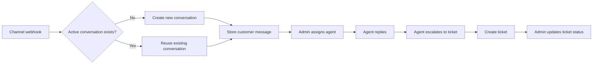
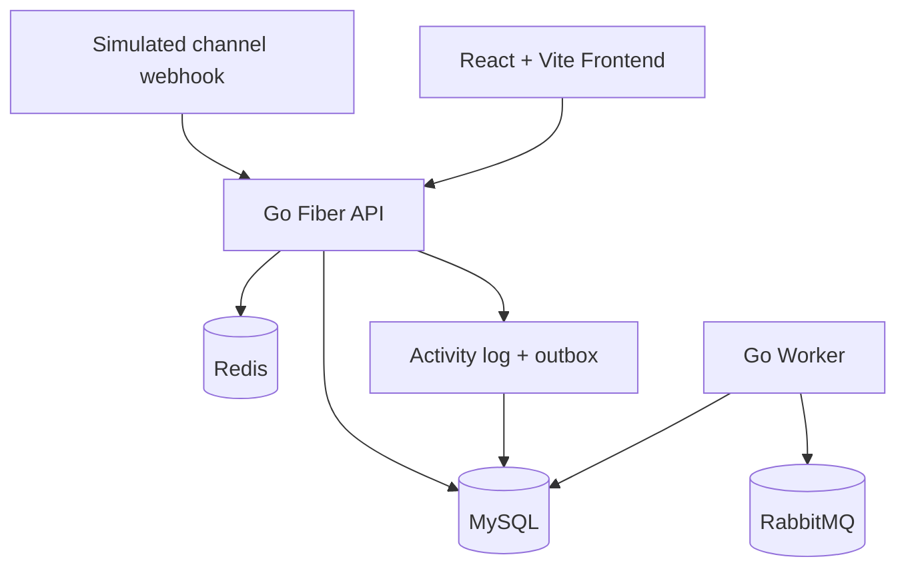

# Sociomile Architecture

[Bahasa Indonesia](ARCHITECTURE.md) | English | [README](../README.en.md)

This document explains the application structure, the main workflow, the multi-tenancy approach, and the implementation trade-offs.

## Main Flow

## Runtime Architecture

## Backend

- `backend/cmd/api`: Fiber API entrypoint
- `backend/cmd/worker`: async outbox publisher worker
- `backend/internal/http`: handlers, middleware, response envelopes, and route registration
- `backend/internal/service`: business rules and tenant-aware authorization
- `backend/internal/repository`: data access with tenant scoping
- `backend/internal/model`: GORM models and status or role constants
- `backend/internal/cache`: Redis helpers for list caching and rate limiting
- `backend/internal/events`: RabbitMQ publisher

## Frontend

- `frontend/src/app`: route shell and page composition
- `frontend/src/features`: auth, conversations, tickets, settings
- `frontend/src/lib`: API client, auth state, i18n, theme state, and agent loading hook
- `frontend/public/locales`: YAML dictionaries

## Runtime Topology

- The API handles authentication, conversation lifecycle, ticket lifecycle, and Swagger serving
- The worker reads pending outbox events and publishes them to RabbitMQ
- MySQL is the source of truth for tenants, users, channels, conversations, messages, tickets, logs, and outbox
- Redis is used for webhook rate limiting and conversation or ticket list caching
- RabbitMQ is the async event transport used by the worker

## Domain and Data Model

Core entities:

- `tenants`
- `users`
- `channels`
- `customers`
- `conversations`
- `messages`
- `tickets`
- `activity_logs`
- `outbox_events`

Key rules implemented in the service layer:

- Authenticated requests derive tenant access from the JWT, not from request payloads
- Only admins can assign conversations
- Only agents can escalate conversations
- One conversation can create at most one ticket
- Only admins can update ticket status
- Conversation and ticket queries are tenant-scoped at the repository layer

## Multi-Tenancy Approach

- Every tenant-owned row includes `tenant_id`
- Authenticated endpoints ignore caller-supplied tenant IDs and use the JWT claim instead
- Repository queries filter by `tenant_id` to prevent cross-tenant reads and writes
- The webhook endpoint is the only public route that accepts `tenant_id`, because it simulates an external channel callback
- Seed data includes two tenants so tenant isolation is easy to validate

## Async Events and Caching

- Domain events are written to both `activity_logs` and `outbox_events`
- The worker publishes pending outbox records to RabbitMQ using the event type as the routing key
- Emitted event families include `conversation.created`, `channel.message.received`, `conversation.assigned`, `conversation.replied`, `conversation.closed`, `conversation.escalated`, `ticket.created`, and `ticket.status.updated`
- Redis is used for list-cache helpers so invalidation does not widen writes to the main database

## Frontend Notes

- The UI uses React Router with protected routes
- Theme preference is stored in `localStorage` under `sociomile-theme`
- Locale preference is stored in `localStorage` under `sociomile-locale`
- Conversation and ticket tables use server-side offset pagination and query-param-driven filters
- Assignment and filtering workflows use tenant-scoped agent lists from `/api/v1/users/agents`

## Assumptions and Trade-Offs

- A monorepo was chosen so backend, frontend, worker, and infrastructure stay easy to review in one repository
- The backend uses row-based multi-tenancy in a shared schema instead of separate databases per tenant
- Swagger is served from a static OpenAPI file instead of generated annotations to keep the deliverable easy to inspect
- The frontend intentionally uses lightweight local state and request utilities to keep the take-home focused on product flow
- Backend containers are built into binaries so Podman startup is predictable and does not recompile on every run
- Rootless Podman required RabbitMQ to run on an explicit named volume as uid `999`, and the worker waits for broker readiness instead of relying on compose startup ordering alone
