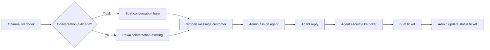
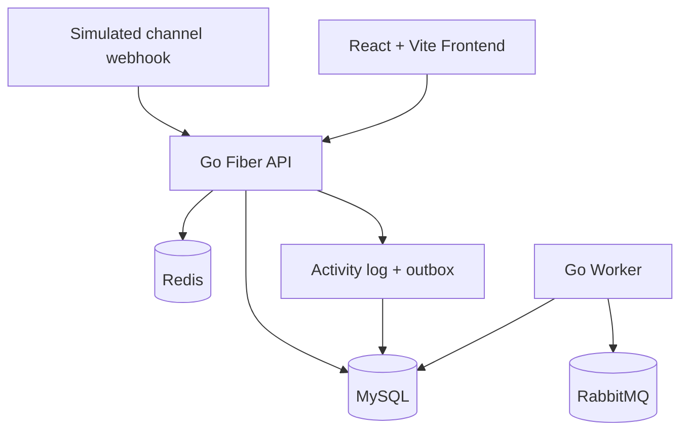

# Arsitektur Sociomile

Bahasa Indonesia | [English](ARCHITECTURE.en.md) | [README](../README.md)

Dokumen ini menjelaskan struktur aplikasi, flow utama, pendekatan multi-tenancy, dan trade-off implementasi.

## Flow Utama

## Arsitektur Runtime

## Backend

- `backend/cmd/api`: entrypoint API Fiber
- `backend/cmd/worker`: worker publisher outbox async
- `backend/internal/http`: handler, middleware, response envelope, dan registrasi route
- `backend/internal/service`: business rule dan otorisasi tenant-aware
- `backend/internal/repository`: data access dengan scoping tenant
- `backend/internal/model`: model GORM serta konstanta status atau role
- `backend/internal/cache`: helper cache Redis untuk list endpoint dan rate limiting
- `backend/internal/events`: publisher RabbitMQ

## Frontend

- `frontend/src/app`: shell route dan komposisi halaman
- `frontend/src/features`: auth, conversations, tickets, settings
- `frontend/src/lib`: API client, auth state, i18n, theme state, dan hook agent
- `frontend/public/locales`: dictionary YAML

## Topologi Runtime

- API menangani autentikasi, lifecycle conversation, lifecycle ticket, dan Swagger
- Worker membaca outbox event yang pending lalu mempublish ke RabbitMQ
- MySQL menjadi source of truth untuk tenant, user, channel, conversation, message, ticket, log, dan outbox
- Redis dipakai untuk rate limiting webhook serta cache list conversation dan ticket
- RabbitMQ menjadi transport event async dari worker

## Domain dan Model Data

Entity utama:

- `tenants`
- `users`
- `channels`
- `customers`
- `conversations`
- `messages`
- `tickets`
- `activity_logs`
- `outbox_events`

Aturan penting yang diimplementasikan pada service layer:

- Request yang sudah login mengambil akses tenant dari JWT, bukan dari payload client
- Hanya admin yang boleh assign conversation
- Hanya agent yang boleh melakukan eskalasi
- Satu conversation hanya boleh menghasilkan maksimal satu ticket
- Hanya admin yang boleh mengubah status ticket
- Query conversation dan ticket selalu dibatasi oleh tenant di repository layer

## Pendekatan Multi-Tenancy

- Setiap row yang dimiliki tenant memiliki `tenant_id`
- Endpoint terproteksi mengabaikan `tenant_id` dari client dan memakai claim JWT
- Query repository memfilter `tenant_id` agar tidak terjadi cross-tenant read atau write
- Endpoint webhook adalah satu-satunya route publik yang menerima `tenant_id` karena mensimulasikan callback dari channel eksternal
- Seed data berisi dua tenant agar isolasi data mudah diverifikasi

## Event Async dan Caching

- Domain event disimpan ke `activity_logs` dan `outbox_events`
- Worker mempublish record outbox yang pending ke RabbitMQ dengan event type sebagai routing key
- Event family yang dipakai mencakup `conversation.created`, `channel.message.received`, `conversation.assigned`, `conversation.replied`, `conversation.closed`, `conversation.escalated`, `ticket.created`, dan `ticket.status.updated`
- Redis dipakai untuk helper cache list endpoint agar invalidasi tidak memperluas write ke database utama

## Catatan Frontend

- UI memakai React Router dengan protected routes
- Preferensi theme disimpan di `localStorage` dengan key `sociomile-theme`
- Preferensi locale disimpan di `localStorage` dengan key `sociomile-locale`
- Tabel conversation dan ticket memakai pagination offset dan filter berbasis query parameter
- Workflow assignment dan filtering memakai daftar agent per tenant dari `/api/v1/users/agents`

## Asumsi dan Trade-Off

- Monorepo dipilih agar backend, frontend, worker, dan infrastruktur mudah direview dalam satu repository
- Backend memakai row-based multi-tenancy dalam satu schema bersama, bukan database terpisah per tenant
- Swagger disajikan dari file OpenAPI statis, bukan generator anotasi, agar deliverable mudah diinspeksi
- Frontend sengaja memakai state dan utility request yang ringan agar fokus take-home tetap pada flow bisnis
- Container backend dibangun menjadi binary agar startup di Podman konsisten dan tidak compile ulang setiap kali run
- Rootless Podman membutuhkan RabbitMQ berjalan pada named volume eksplisit dengan uid `999`, dan worker menunggu broker siap daripada mengandalkan urutan startup compose
